# AqMood - a slightly emotional Air Quality Monitor

Measures PM2.5, VOC, CO2, NOX, Temp and Humidity, Shows emojis or details on LCD and uses aRGB Leds to show air quality

## Description

This is my last iteration of a DIY Air Quality Monitor. 

## Features

Emoji and LED-Based AirQuality Display with Home Assistant integration.

* 1.8" Color LCD with 6 Display Modes
* 4 x aRGB Leds to show AQI for PM, VOC, CO2 and NOX
* Touch button - Short press cycles through display modes, long press toggles Leds
* HomeAssistant integration (optional)
* Quite easy to build with custom PCB

Measures
* PM(1.0, 2.5, 4.0, 10)
* VOC
* CO2
* NOX
* Temperature
* Humidity
* AQI (PM2.5,VOC,CO2,NOX and overall)

### Display modes

aqMood offers 6 different display modes. The LEDs can be turned on and off.

#### aRGB LEDs used to indicate AQI for PM2.5, VOC, CO2
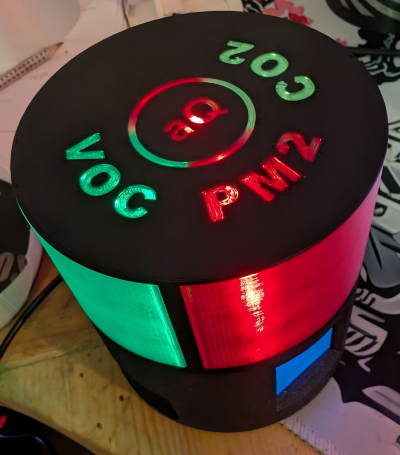

#### Big Emoji - Summarize alle 3 AQI (PM2.5,VOC,CO2)
")
 
#### Emoji AQI overview
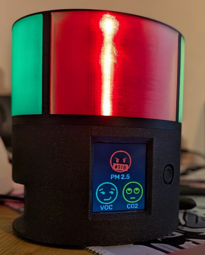

#### AQI Details
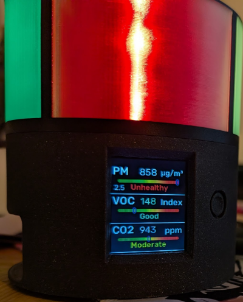

#### Temperature, Humidity and NOX
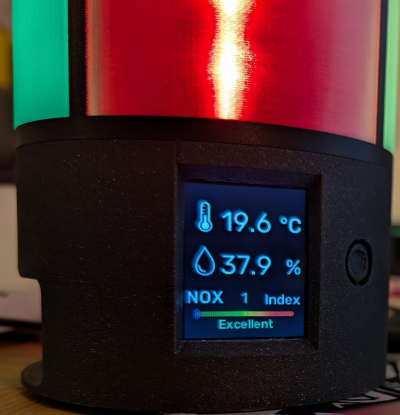

#### Particles details
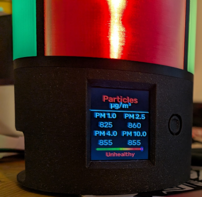

#### Off ;)
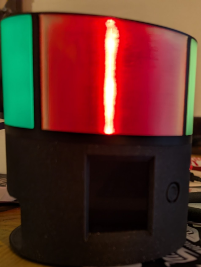

## How is it built?

Esphome based

### Bill of Material
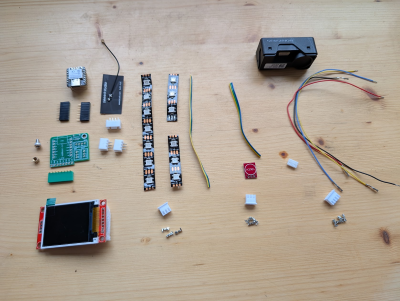

* XIAO Seeed ESP32-S3 or C3 - [Amazon S3](https://amzn.to/423OqtX), [Amazon C3](https://amzn.to/4iRqP58)
* SEN66 sensor [Ebay - Eu only](https://www.ebay.at/itm/388088341147)
* LCD 1.8 SPI - [Amazon](https://amzn.to/3FvKMQR)
* WS2812b 4 Leds 60leds/m strip - [Amazon](https://amzn.to/4bvql2q)
* Custom PCB, order from JLCPCP or PCPWAY
* Touch button - TTP223 - [Amazon](https://amzn.to/4knrMUJ)
* 1 x GH1.25 male - 6pin - [Amazon](https://amzn.to/3XXllhl)
* 1 x JST-XH 2.5 male - 4pin - [Amazon](https://amzn.to/426rlXr)
* 2 x JST-XH 2.5 male - 3pin - [Amazon](https://amzn.to/426rlXr)
* 1 x JST-XH 2.5 female - 4pin - [Amazon](https://amzn.to/426rlXr)
* 2 x JST-XH 2.5 female - 3pin - [Amazon](https://amzn.to/426rlXr)
* 1 x Pin header 2.54 - 8pin (8.5mm) - [Amazon](https://amzn.to/41SFNRz)
* 2 x Pin header 2.54- 7pin - [Amazon](https://amzn.to/41SFNRz)
* Some wires 
* Printed 3D Model, 2 parts

### Tools
* Soldering Iron
* Crimping tool

### Sensirion SEN66 - new, all-in-one aq sensor from Sensirion

It combines all the most important AQ sensors into one small package!

Unfortunately, the sensor is a bit expensive and harder to get, as it is brand new.

It starts around 55€ at the moment but I am sure the price will fall next year as it happened to the predecessor (SEN5X series).

I bought mine from Digikey, but here are some more links:

https://www.tme.eu/at/details/sen66-sin-t/gassensoren/sensirion/3-001-030/

https://www.mouser.at/ProductDetail/Sensirion/SEN66-SIN-T-ES

https://www.digikey.at/en/products/detail/sensirion-ag/sen66-sin-t/25700945

As i bought some extra, i sell 2 or 3 on [ebay](https://www.ebay.at/itm/388088341147), €62 in austria shipping included, EU + shipping

## PCB
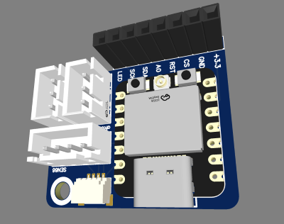

Gerber file to order at JLCPCP or PCBWAY or ....
[Gerber_aqMood_PCB_aqMood_seeed_c3_2025-03-14.zip](PCB/Gerber_aqMood_PCB_aqMood_seeed_c3_2025-03-14.zip)

or get it from here:

https://oshwlab.com/tobi.stanzel/aqmood

Qwiic connector is optional, as it would require SMD soldering equipment.

## Print instructions

3 files, the top can be printed in multi-color, i used 0.2 Speed settings on my XL and MK4 with PLA.

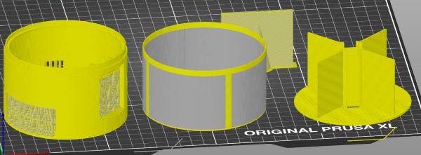

### AqMood-Bottom
Print in main color.

This needs some supports, check example:

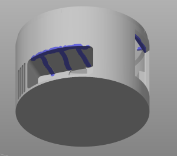

### AqMood-Top
When importing, choose "Yes" to "... single object having multiple parts?"

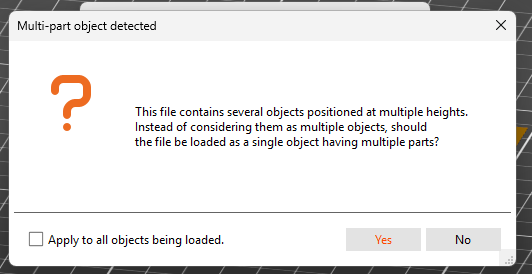

Print in transparent color or 

if you have a multicolor printer, set the parts like this (yellow is main color, gray is transparent)

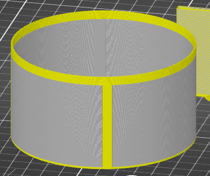

### AqMood-LedTower

Print in main color.

## Build Guide

### Prepare PCB 

Bend the 8pin pin header by 90 degrees, works very well on a solid ground.

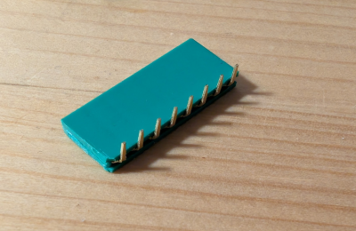

Solder all connectors and pin headers to the pcb like this:

The 8pin header for the LCD is soldered from the bottom, like shown in the image.

The qwiic connector is not needed! It is optional in case you have SMD solder equipment. 

### Prepare Leds

You need 1x7 Leds and 2x 3 leds, 13 in total, prepare them like this:

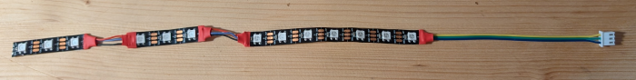

Make sure + and ground are correct!

The order of the LEDs is important to match the text on the top!

Start on the side with the nodge with the 7 leds going over the top and back into the bottom.

Next is the left side, get both 3*Leds first to the top again and then below the LED strip back down on the other side.

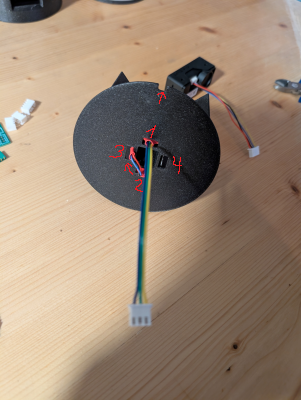

### Prepare the Touch Button

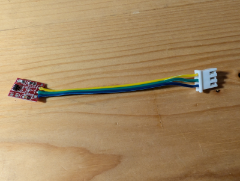

Make sure + and ground are correct!

### Prepare SEN66

Prepare a cable with  GH1.25 male - 6pin on one side and JST-XH 2.5 male - 4pin on the other side like this:

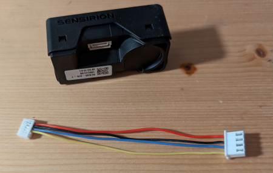

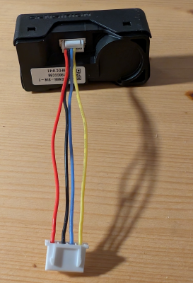

### Connect and Test Hardware 

Connect everything and flash the firmware. I recommend testing everything before final assembly.

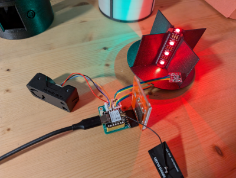

Leds should work (might need to enable by long press the button) and LCD should show the UI.

Test cycle through the display modes. It might take up to 20 sec until all measurements are available.

### Final Assembly 

Remove supports from the 3D printed parts and add the heat insert. 

Insert the SEN66 sensor, and disconnect it from the PCB if you have tested it.

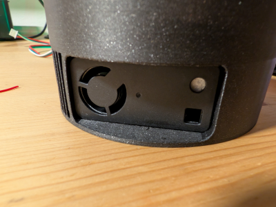

Insert the heat insert now into the bottom part!

Insert the PCB with the LCD and connect everthing.

Use M3x5 screw to secure pcb.

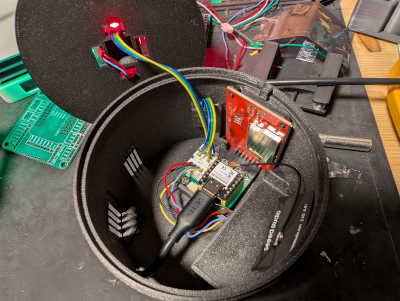

But the LED tower on and then the top part, DONE!

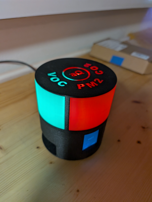

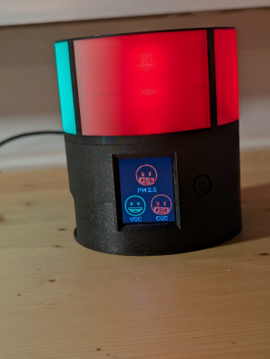

## Firmware

If you don't want to build and flash with esphome yourself, you can use one of the four pre-build firmwares:
* [firmware.c3.bin](esphome/bin/firmware.c3.bin)
* [firmware.c3.standalone.bin - no WIFI / Home Assistant](esphome/bin/firmware.c3.standalone.bin)
* [firmware.s3.bin](esphome/bin/firmware.s3.bin)
* [firmware.s3.standalone.bin - no WIFI / Home Assistant](esphome/bin/firmware.s3.standalone.bin)

Files with "standalone" inm the name are the versions without wifi/home assistant supptort
Make sure you flaash the correct version for your ESP!

### How to flash the firmware - easy mode

Use https://web.esphome.io/ to flash one of the 2 provided firmeware flavours:
* With wifi and home assistant firmware.c3.bin or firmware.s3.bin
* Standalone - firmware.c3.standalone.bin or firmware.s3.standalone.bin

Go to https://web.esphome.io/ 

connect your xiao-seed-esp32-s3 or c3 and 

hold reset and boot (both buttons), 

release reset first, this puts  the esp32 into flash mode.

Now hit connect and select the device

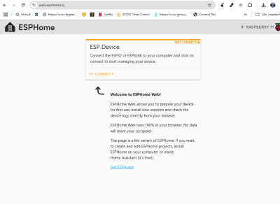

You will see a screen like this, hit "Install"

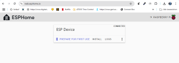

Select the firmware file and fit "upload", it will take 1-2 min to install

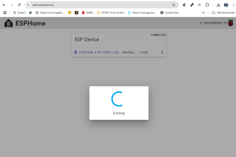

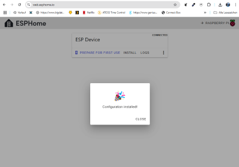

The firmware is now flashed and aqMood should reboot and start working!

## WIFI Setup

If you  choose to use aqMood together with home assistant, you need to connect aqMood to your wifi now

First, connect to the AP that is created

AP: mista-aq-mood-c3 or mista-aq-mood-s3
PW: aqMoodaqMood

Then go to '192.168.4.1' in your browser of choice

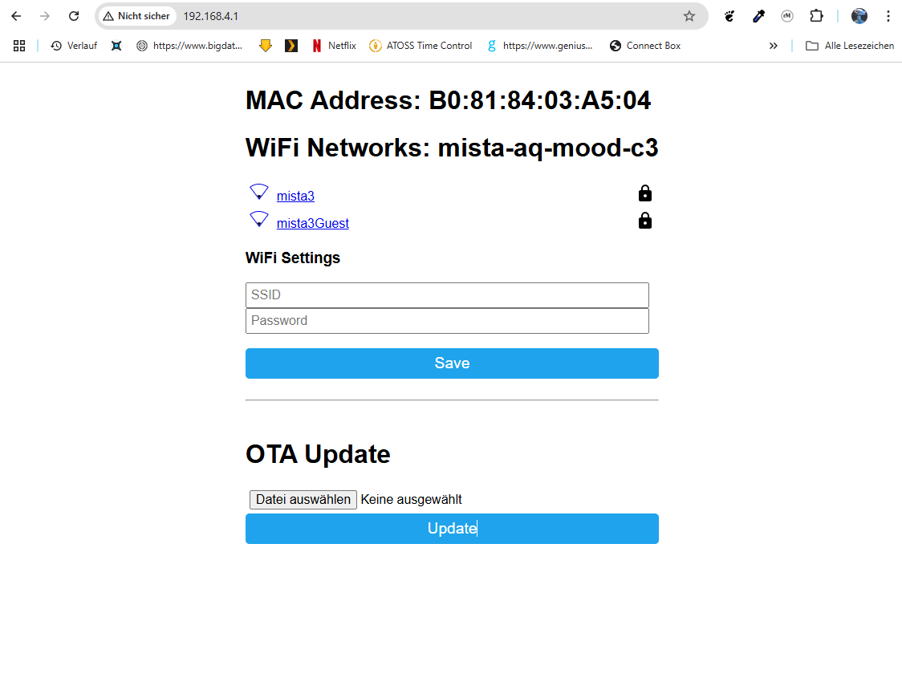

and set your SSID and PW, done!

## Home assistant 

This shows all availiable values in home assistant provided by AqMood.

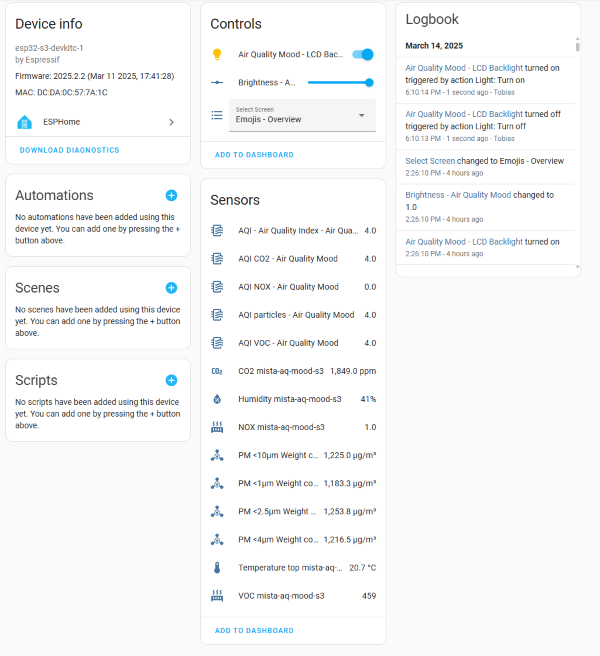

### Passwords for home assistant api and OTA

#### Home assistant api password
aqmoodpw

#### Esphome OTA password
aqmoodpw

## Build with esphome

Current version was compiled with esphome 2025.2.2.

Run esphome run aq-mood-c3.yaml in the esphome folder to build and upload your version.

Passwords are stored in secrets.yaml, some stuff can be easily modified in the main file aq-mood-c3.yaml in the SUBSTITIONS section.

If you want to code a wifi pw hard, this is done in src/aq-mood-home-assistant.yaml

As of now, there is no official driver for the sen66 sensor in esphome, so I quickly adopted the sen5X driver and published it here: https://github.com/tuct/esphome_external_components

This will be updated to use the official driver as soon as it is released.
