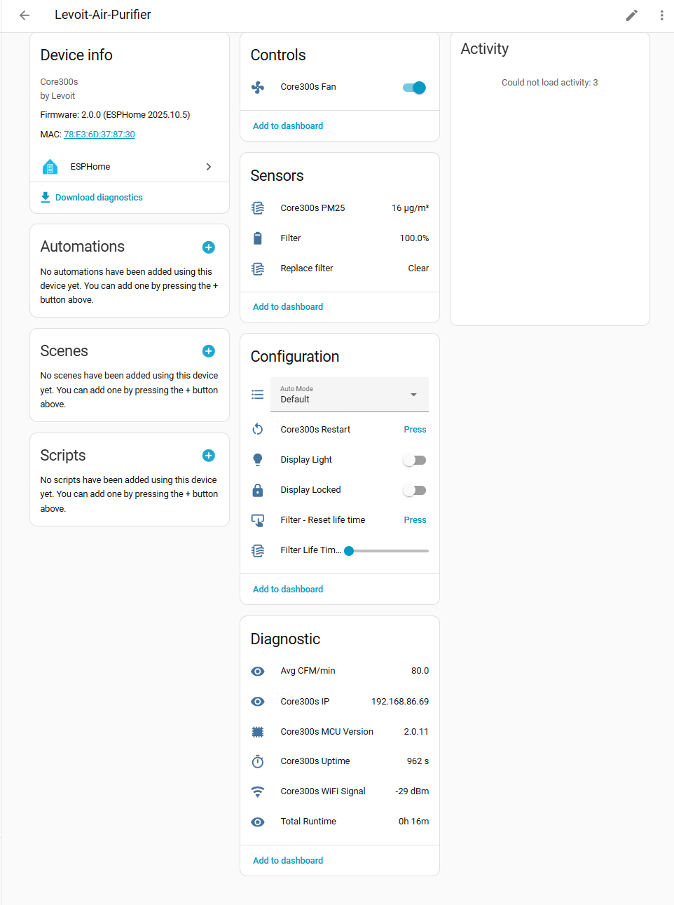

# Levoit Core 300s Custom Firmware




I started using this [implenetation](https://github.com/acvigue/esphome-levoit-air-purifier), but it crashed with some freeRTos errors, so i switched to [this one.](https://github.com/mulcmu/esphome-levoit-core300s)


## Features

* Fan component with modes (Manual, Auto, Sleep)
* Display current and avg CFM value
* Filter life time 
  * Tracking based on current CFM value
  * Configurable via Home Assistant (1-12 Months)
  * Reset via Home Assistant
* Display run time in Home Assistant

## Changes to [original](https://github.com/mulcmu/esphome-levoit-core300s)

* Added Fan component, so that i can use it with my fan group ;)
  * Preset Modes are part of Fan 
* Added Filter Life time based on info from below
  * Filter Life Time configurable between 1-12 months
  * Based on CFM per Mode and Runtime, Max Hours = 141CFM*24*30* Filter Life time (months)
  * Filter Led works
  * Reset Filter implemented
* Removed BLE


Supported / Tested MCU Version: 2.0.11

## Disassembly

For details on the teardown please read the [blog post](https://vigue.me/posts/levoit-air-purifier-esphome-conversion)

* Place upside down and remove base cover and filter to expose 8 screws (4 have washers)
* Remove all 8 screws be careful, as these are made out of a soft metal
* Using a pry tool slide in between tabs
* Separate base and top sleeve
* Unplug logic board


## Flash

* Solder wires to pins TXD0, RXD0, IO0, +3V3, and GND near the ESP32 on the logic board, and connect these to a USB-UART converter. On some boards, if these are through holes, soldering may not be necessary.
* Connect IO0 to ground during power before connecting USB-UART to boot to bootloader. On some boards, IO0 may not have it's own debug pin and the ESP32 GPIO0 pin on the esp can be used.

### Backup Existing Firmware
```
esptool read_flash 0 ALL levoit.bin
```

This did not work for me, always ended in an error, so i yoloed it and continued without a backup of the original FW

### Update name and set secrets

Rename `secrets-example.yaml` to `secrets.yaml` and set your wifi and encryption key, ...

Adopt device name if needed in `core300s.yaml` (multiple units!)

### Compile and Install New Firmware

```
esphome run core300s.yaml
```
  
& reassemble, enjoy :)

#### In case you want to flash back original FW

```
esptool erase_flash
esptool write_flash 0x00 levoit.bin
```


### Filter Life:

Manufacturer lists the filter life at 6 to 8 months and provided clean air deliver rates (CADR) for the different fan modes.

| Fan Speed | CADR    |
| --------- | ------- |
| Sleep     | 37 CFM  |
| Low       | 60 CFM  |
| Med       | 80 CFM  |
| High      | 141 CFM |

Filter lifetime air volume will be estimated based on user provided number of months and 24h operation on High.  The actual air volume through the filter will be estimated based actual runtime and volume for each fan speed.

Filter state sensor will provide a remaining lifetime percent.  Filter service interval will also be selectable and tracked.  Filter service is basically just to vacuum pre-filter.
